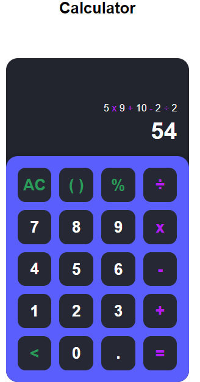

# calculator

## Description
The Calculator Web App is a simple and user-friendly application designed to perform basic arithmetic operations such as addition, subtraction, multiplication and division. Built with HTML, CSS and JavaScript, this web app provides a clean, responsive and intuitive interface for performing calculations, making it easy to use on both desktop and mobile devices.

## Prerequisites
N/A

## Features
* Basic arithmetic operations: addition, subtraction, multiplication and division.
* Responsive design for mobile and desktop use.

## Technologies Used
Built with:
* HTML
* CSS
* JavaScript

## Installation
N/A

## Usage
* Open the Calculator web application in your browser.
* Use the on-screen buttons to perform calculations.

## Project Link
Application can can be viewed here: 
* [Live](https://yvonnesarah.github.io/calculator/)

* [Repository](https://github.com/yvonnesarah/calculator)

## Screenshot(S)
Calculator

Calculator Example

## Credit
N/A

## Licence
Please refer to the LICENSE in the repo.
